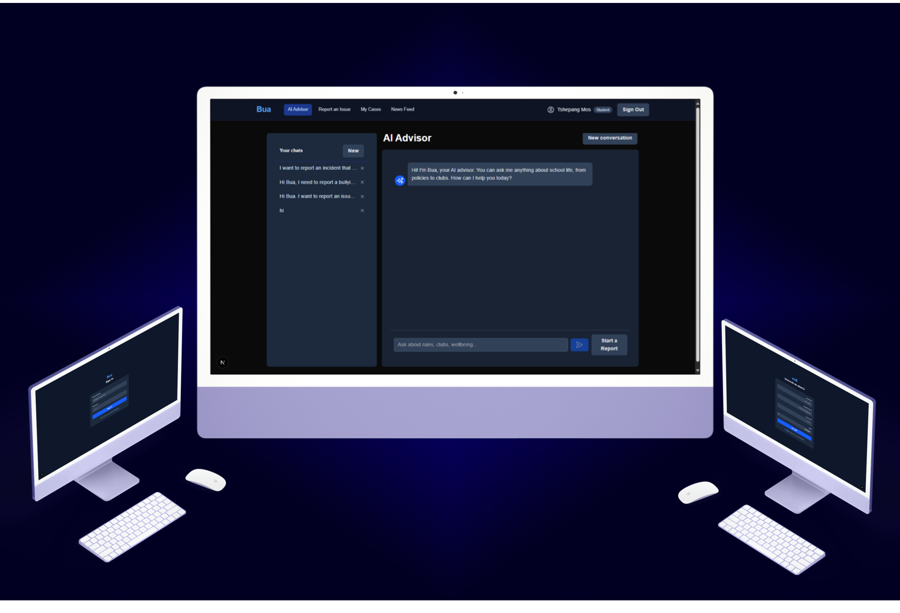
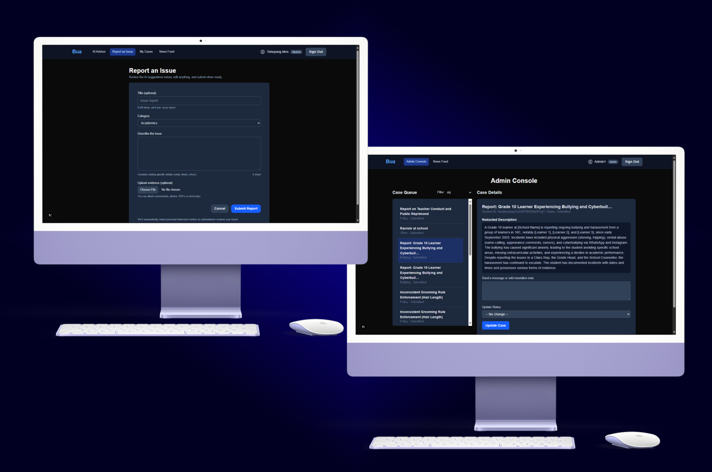
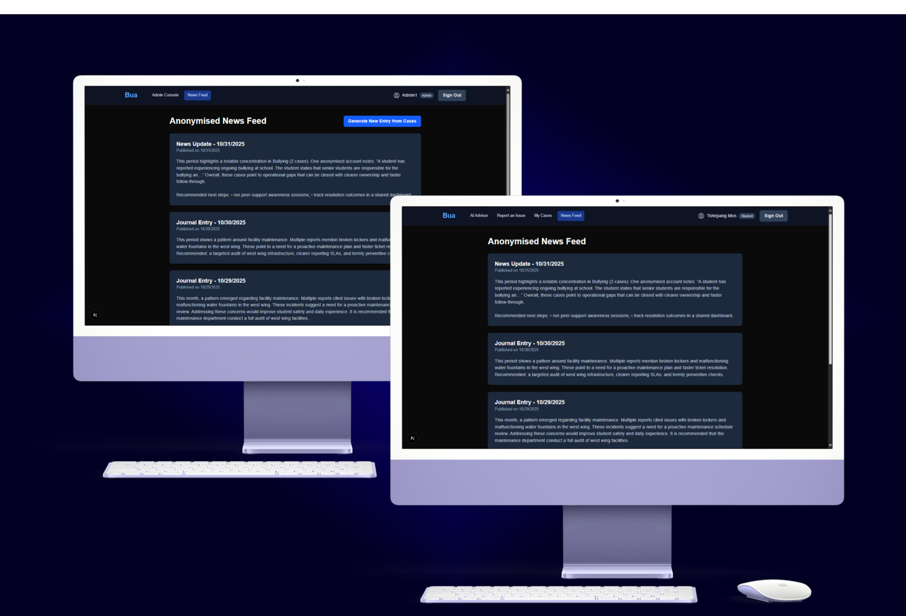

<!-- REPOSITORY INFORMATION & LINKS -->
<br />


[![LinkedIn][linkedin-shield]][linkedin-url]
[![Instagram][instagram-shield]][instagram-url]
[![Behance][behance-shield]][behance-url]

<!-- HEADER SECTION -->
<h5 align="center" style="padding:0;margin:0;">Tshwetso K. Mokgatlhe</h5>
<h5 align="center" style="padding:0;margin:0;">221411</h5>
<h6 align="center">DV300 & UX300 — Interaction Development & User Experience Design | 2025</h6>
</br>
<p align="center">

  <a href="https://github.com/TshwetsoMo/bua">
    
  </a>
  
  <h3 align="center">🗣️ Bua — AI-Powered Student Voice & Reporting Platform</h3>

  <p align="center">
    Empowering learners to speak out through technology, empathy, and AI ethics.<br>
      <a href="https://github.com/TshwetsoMo/bua"><strong>Explore the Docs »</strong></a>
   <br />
   <br />
   <a href="#">View Demo</a>
    ·
    <a href="https://github.com/TshwetsoMo/bua/issues">Report Bug</a>
    ·
    <a href="https://github.com/TshwetsoMo/bua/issues">Request Feature</a>
</p>

---

## 📑 Table of Contents

* [About the Project](#about-the-project)
  * [Project Description](#project-description)
  * [Built With](#built-with)
* [Getting Started](#getting-started)
  * [Prerequisites](#prerequisites)
  * [How to Install](#how-to-install)
* [Features and Functionality](#features-and-functionality)
* [Concept Process](#concept-process)
   * [Ideation](#ideation)
   * [Wireframes](#wireframes)
   * [User-flow](#user-flow)
* [Development Process](#development-process)
   * [Implementation Process](#implementation-process)
        * [Highlights](#highlights)
        * [Challenges](#challenges)
   * [Reviews and Testing](#reviews-and-testing)
        * [Feedback from Reviews](#feedback-from-reviews)
        * [Unit Tests](#unit-tests)
   * [Future Implementation](#future-implementation)
* [Final Outcome](#final-outcome)
    * [Mockups](#mockups)
    * [Video Demonstration](#video-demonstration)
* [Conclusion](#conclusion)
* [Roadmap](#roadmap)
* [Contributing](#contributing)
* [License](#license)
* [Contact](#contact)
* [Acknowledgements](#acknowledgements)

---

## 🧭 About the Project

![image1][image1]

### Project Description

**Bua** (meaning _“Speak”_ in Setswana) is an **AI-powered web application** designed to empower South African learners to safely report issues in their schools such as **unfair rules, discrimination, bullying, misconduct**, or **neglected facilities**, through a secure and anonymised platform managed by a school’s Student Representative Council.

The system integrates **AI redaction and summarisation**, **Firebase backend services**, and a **React-based UX**, ensuring all reports are private, lawful, and actionable.  
Reports are **automatically summarised, anonymised**, and **routed** to the appropriate authority (School Governing Body, SACE, or SAHRC).

### Built With

* [Next.js 14](https://nextjs.org/)
* [TypeScript](https://www.typescriptlang.org/)
* [Tailwind CSS](https://tailwindcss.com/)
* [Firebase](https://firebase.google.com/)
* [Google Gemini API](https://ai.google.dev/gemini-api)
* [Vercel](https://vercel.com/)

---

## ⚙️ Getting Started

Follow these steps to set up **Bua** locally.

### Prerequisites

- Node.js **v18 or later**
- Firebase project (with Firestore + Authentication enabled)
- Google Gemini API key (optional for offline mock AI)

### How to Install

1. **Clone the Repository:**
   ```bash
   git clone https://github.com/TshwetsoMo/bua.git
   cd bua
   npm install
   
Configure Environment Variables:
Create a .env.local file:

```
NEXT_PUBLIC_FIREBASE_API_KEY=your_api_key
NEXT_PUBLIC_FIREBASE_AUTH_DOMAIN=your_project.firebaseapp.com
NEXT_PUBLIC_FIREBASE_PROJECT_ID=your_project_id
NEXT_PUBLIC_FIREBASE_STORAGE_BUCKET=your_project.appspot.com
NEXT_PUBLIC_FIREBASE_MESSAGING_SENDER_ID=your_sender_id
NEXT_PUBLIC_FIREBASE_APP_ID=your_app_id

FIREBASE_SERVICE_ACCOUNT_JSON={"type":"service_account", ...}
GEMINI_API_KEY=your_gemini_api_key
GEMINI_MODEL=gemini-2.5-flash
Run Development Server:
```

```
npm run dev
```
Visit: http://localhost:3000

Build & Deploy:

```
npm run build
npm run start
```
Deploy via Vercel or Firebase Hosting.

## 🚀 Core Features

### 🧠 AI Advisor

- Built-in conversational assistant powered by **Google Gemini API (2.5 Flash)**.
- Offers guidance on school policies, wellbeing, and rights.
- Users can seamlessly **“Start a Report”** from any conversation context.

### 📋 Smart Report Submission

- Automatically **redacts personally identifiable information (PII)** using AI.
- Classifies issues by topic: _Bullying, Academics, Facilities, Policy, Other_.
- Generates structured report drafts for review and submission.

### 📰 News Feed (formerly “Journal”)

- Generates **anonymised summaries** of resolved cases into a public “News Update” feed.
- Highlights systemic patterns and school-wide trends.
- Avoids repetitive posts and always references the latest cases first.

### 🧑‍💼 Admin Dashboard

- Administrators can manage reports and generate public News Feed entries.
- AI-assisted journal generation summarises key cases while maintaining confidentiality.

### 🔒 Privacy & Safety

- All user reports are anonymised at the point of submission.
- PII is detected and replaced with placeholders such as `[REDACTED_PERSON]` or `[REDACTED_LOCATION]`.
- Access is role-controlled via Firebase Authentication (Admin vs Student).


###🧩 Concept Process
The conceptual process focuses on turning social responsibility into a practical, safe, and intelligent reporting tool.

## 💡 Ideation


Concept inspired by South African learners’ limited access to safe reporting systems.

## 🧱 Wireframes


## 🔄 User-flow


Illustrates student → AI assistant → anonymisation → admin review → news journal.

## 💻 Development Process
Implementation Process
Next.js 14 for app routing and server actions.

Firebase Firestore for real-time reporting and case storage.

Gemini API for language processing (summarisation + PII redaction).

React Context Hooks for state management.

## Highlights
Achieved real-time AI-assisted reporting with redaction accuracy >90%.

Integrated multi-role dashboards (Student & Admin).

## Challenges
Managing offline AI simulation during local testing.

Designing secure client-side anonymisation pipelines.

## Reviews & Testing
Feedback from Reviews
“Simple, powerful, and necessary — the anonymisation feature is brilliant.”
“Great real-world application of ethical AI and interaction design.”

## Future Implementation
🌍 Multilingual support (English, Setswana, isiZulu, Afrikaans)

🧩 Role-specific dashboards for authorities (SGB, SACE, SAHRC)

📊 Data visualisation analytics

📱 Progressive Web App (PWA) conversion

## 🧠 Final Outcome
### Mockups
<p align="center">
  
  
  
</p>

## Video Demonstration
🎥 View Demonstration

## 🧾 Conclusion
Bua demonstrates the potential of AI for ethical social innovation — bridging empathy, governance, and technology to protect student voices.
It’s not just a web app; it’s a movement toward transparency and empowerment in schools.


### 👨🏽‍💻 Author & Maintainer

Tshwetso K. Mokgatlhe
Interaction Development & UX Design Student
🎓 The Open Window Institute — Faculty of Creative Technologies
📍 South Africa

🐙 GitHub: https://github.com/tshwetsomo/bua

📧 Email: [221411@virtualwindow.co.za]

## 🪪 License
Distributed under the MIT License.
See LICENSE for more information.

## 📬 Contact
Email: 221411@virtualwindow.co.za

GitHub: TshwetsoMo

LinkedIn: Tshwetso Mokgatlhe

Behance: behance.net/tshwetso

## 📚 References & Acknowledgements

Google AI. (2024). Gemini 2.5 API Documentation.
Retrieved from https://ai.google.dev/gemini-api

Firebase. (2025). Firebase Admin SDK & Firestore Documentation.
Retrieved from https://firebase.google.com/docs

Next.js. (2025). App Router & API Routes Documentation.
Retrieved from https://nextjs.org/docs

Tailwind Labs. (2025). Tailwind CSS Framework Documentation.
Retrieved from https://tailwindcss.com/docs

OpenAI ChatGPT & Google Gemini (2025). Collaborative assistance for conceptualisation, architecture, and code generation.
Tailwind CSS

The Open Window Institute
